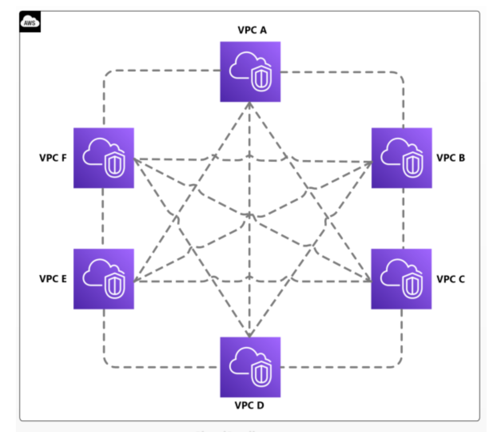
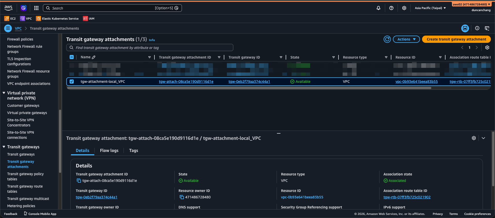
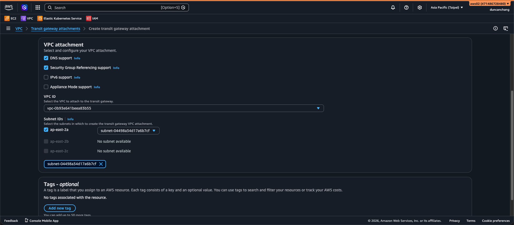
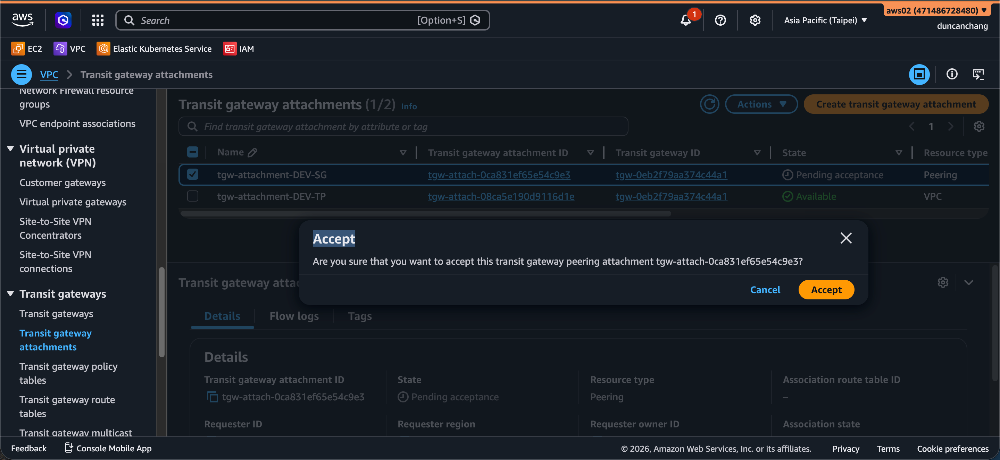
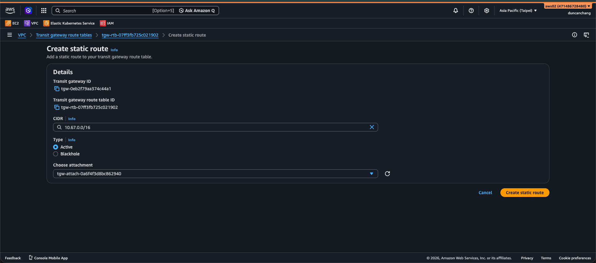
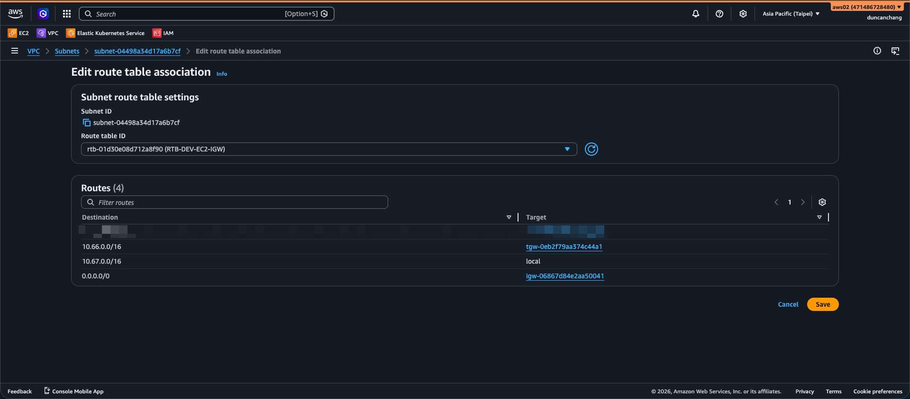
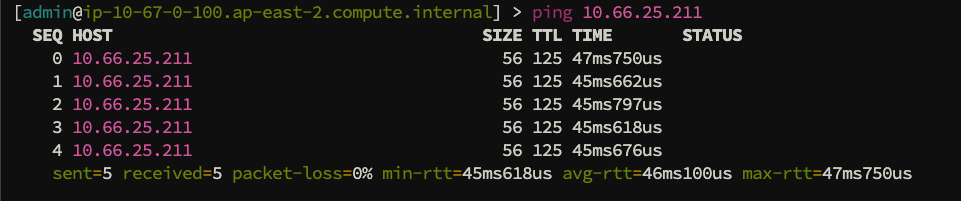

# AWS Transit Gateway

# **AWS Transit Gateway 從架構演進到實務維運**

# 1. 雲端網路演進與 TGW 的定位

## 1.1 網路架構的演進痛點

在雲端環境初期，通常只有少數幾個 VPC，使用 **VPC Peering** 進行串聯既簡單又快速。但隨著業務增長，挑戰也隨之而來：

- **1對1限制：** VPC Peering 不支援「傳遞性 (Transitivity)」。若 A 聯連 B，B 連接 C，A 無法透過 B 連向 C。
- **全網狀 (Full Mesh) 陷阱：** 當你有 10 個 VPC 需要互通時，你需要維護 10*(10-1)/2 = 45 條連線。
- **管理爆炸：** 路由表散落在各個 VPC 內，更新一條路徑可能要動到數十個設定點，極易出錯。

---

## 1.2 TGW 的核心價值：為什麼我們需要它？

AWS Transit Gateway 扮演的是「雲端虛擬轉運站」的角色，透過中心化的樞紐架構，解決大規模網路的連接與管理問題。

### 🎯 三大核心應用優勢

- **簡化架構：從「網狀」轉為「星狀」 (Hub-and-Spoke)**
    - **消除複雜度：** 將 VPC、VPN 與 Direct Connect 匯集到 TGW 中心，徹底消除難以維護的點對點 (Peering) 連線。
- **靈活掌控：集中路由與環境隔離**
    - **減少路由負擔：** 跨 VPC 的連線邏輯集中在 TGW 路由表處理。
    - **邏輯隔離：** 透過建立不同的路由表，可輕鬆實現「開發環境」與「生產環境」共用設備但實體隔離，兼顧彈性與安全性。
- **跨帳號與混合雲骨幹 (Scalability & Hybrid Cloud)**
    - **企業級擴充：** 支援 **AWS RAM** 跨帳號共享，單一 TGW 可連接多達 5,000 個 VPC，滿足單位長期擴張需求。
    - **整合地端連線：** 將地端 VPN 或 Direct Connect 直接掛載到 TGW，讓所有 VPC 都能共用這條地端連線，不需重複建設，節省大量成本。

---

## 1.3 核心對決：VPC Peering vs. Transit Gateway

| 比較維度 | VPC Peering (傳統模式) | Transit Gateway (現代模式) |
| --- | --- | --- |
| **連線模式** | 點對點 (Point-to-Point) | 星狀樞紐 (Hub-and-Spoke) |
| **傳遞性** | ❌ 否 (A→B→C 不通) | ✅ 是 (A→TGW→C 可互通) |
| **管理複雜度** | 指數級成長 (難以大規模維護) | 線性成長 (集中在 TGW 路由表) |
| **頻寬能力** | 無特定上限 (視執行個體而定) | 每個 Attachment 支援 50 Gbps |
| **安全檢查** | 難以實作集中式流量檢查 | ✅ 可輕鬆導入集中式防火牆 (Inspection VPC) |
| **跨帳號管理** | 需手動雙向接受請求 | 透過 AWS RAM 批次共享，極其方便 |
| **成本結構** | 無額外固定費 (僅流量費) | 有固定小時費 + 數據處理費 |

---

---

# 2. 配置介紹：跨區域 TGW 串接實作

💡 **實驗目標**：

建立跨區域骨幹，實現  `Region SG (Dev-SG)` 與 `Region TP (Dev-TP)` 的網路串接。

- **Dev-SG (Region SG) :** `10.66.0.0/16`
- **Dev-TP (Region TP)**: `10.67.0.0/16`

## 第一階段：區域內基礎配置 (Local Setup)

### 1. Create transit gateway

- 在  **Dev-SG**建立 `transit-gateway-SG`(名稱自訂)
- 在  **Dev-TP** 建立 `transit-gateway-TP`(名稱自訂)

`Create transit gateway` → 

- Name tag :  (自訂名稱)
- 其他配置 : 預設

### 2. 建立 VPC Attachment

當transit gateway建立完成後，將當地的 VPC 掛載到當地的 TGW 上。

- Region SG : 建立 Attachment `tgw-attachment-local_VPC`，將 `VPC Dev-SG` 接入 `transit-gateway-SG`。
- Region SG : 建立 Attachment`tgw-attachment-local_VPC`，將 `VPC Dev-TP` 接入 `transit-gateway-TP`。

**Create transit gateway attachment →**

- Name tag : `tgw-attachment-local_VPC`
- Transit gateway ID : 選取上一步驟建立的 tgw
- Attachment type : `VPC`
- VPC ID : 選擇要透過tgw繞送的VPC
- Subnet ID :  建議已經啟用az都選 (若未來有增加az要記得回頭來這邊改配置

---

## 第二階段：建立 TGW Peering (跨區橋樑)

這是連接兩個「轉運站」的關鍵步驟。請注意，這條連線**不支援**路由自動學習 (Propagation)。

1. **發起請求 Region SG (任選一端發起)**:
    
    Attachments 頁面，點選 **Create Transit Gateway Attachment**
    
    - Name tag : `tgw-peering-TP`
    - Transit gateway ID : 選取第一階段建立的 tgw
    - Attachment type : `Peering connection`
    
    Peering Connection Attachment
    
    - Account : `My account`  (若不同帳號選擇 Other 並填入 AWS `Account ID` )
    - Region : `Asia Pacific (Taipie)` (依照實際狀況填入)
    - Transit gateway : 填入對接 tgw ID
    
    
    
2. **接受請求 (切換到Region TP)**:
    - 切換到  `Region TP`，在 Attachments 列表會看到狀態為 `Pending Acceptance`。
    - 點選 **Actions > Accept**。
        
        
        
        (補充) 範例圖片非實際lab內容
        

---

## 第三階段：核心路由配置 (關鍵步驟)

⚠️ **重點提醒：為什麼這裡要手動寫路由？**

- **跨區域 (Cross-Region)：** 概念上，不同區域的 TGW 路由表（RTB）**雙方是不認識彼此的**。即使 Peering 連線已建立，路由表也不會自動交換資訊。因此，你**必須手動添加「靜態路由」**，明確告訴 TGW 如何到達對面區域。
- **同區域 (Same Region)：**
反之，如果是同一個區域內的 VPC 透過 TGW 串接，只要開啟了 **Propagation (傳播)**，系統就會**自動生成**相關路由，不需要手動添加靜態路由。

### 1. 設定 TGW 路由表 (TGW Route Table)

封包進入轉運站後，TGW 需要知道怎麼去「對面區域」。

| 所在區域 | 目的地 (Destination) | 目標 (Target) |
| --- | --- | --- |
| Region SG | `10.67.0.0/16` (Dev-TP) | 選取peering的TGW Attachment |
| Region TP | `10.66.0.0/16` (Dev-SG) | 選取peering的TGW Attachment |

建立靜態路由( 以Region SG為例)

**點選 Acstions → Create static route**

CIDR : `10.0.67.0.0/16`

Type : `Active`

Choose attachment : 選取peering的TGW Attachment

<aside>
💡

1. 把要導的路由指向到peering的tgw
2. 對端Region TP 也要有相同配置把10.66.0.0 → peering tgw
3. 在第一階段建立tgw的元件時，tgw rtb就會自動生成無須手動建立(補充說明)
</aside>

### 2. 設定 VPC 路由表 (VPC Route Table)

封包要離開 VPC 時，必須明確告訴它「出口在哪」。

- **VPC  Dev-EC2-IGW路由表 (Region SG )**:
    - 新增路由：`10.67.0.0/16` → Target: `TGW ID` (選取)
- **VPC  Dev-EC2-IGW路由表 (Region TP )**:
    - 新增路由：`10.66.0.0/16` → Target: `TGW ID` (選取)

---

## 第四階段：資安規則開通 (Security Group)

**⚠️ 即使路由表正確，SG 沒開通流量依然無法抵達。**

### 1. Security Group (SG)

以範例中如果要讓Region TP的EC2(10.67.0.100) 可以連入 Region SG的AWS Linux(10.66.25.211)

1. Region SG **AWS Linux** 的 **`Security Group`**
2. **編輯入向規則 (Edit Inbound Rules)**：
    - **Type**: `All ICMP - IPv4` 或 `All Traffic`
    - **Protocol**: `ICMP` 或 `All`
    - **Source**: 輸入 Region TP EC2 **的網段** `10.67.0.100/32`

<aside>
💡

最終由SG去精準控制要允許流量進入Protocal及Soure IP範圍

</aside>

---

## 第五階段：驗證及測試

測試相關配置是否可連通 → OK完成

---

# 3.結論與實務評估

## 3.1 成本分析

TGW 提供強大的管理能力，但它是具備「入場費」的服務，這點與 Peering 有本質區別。

| 費用項目 | VPC Peering | Transit Gateway |
| --- | --- | --- |
| **建置費用 (固定費)** | 💰 **$0** (完全免費) | 💸 **每小時約 $0.07 /per TGW** |
| **數據處理費 (Data Processing)** | 💰 **$0.08** **USD(In&Out都收)** | 💸 **每 GB 約 $0.02** (經過就收錢) |
| **管理成本 (隱形成本)** | 隨 VPC 增加呈指數成長 | 集中管理，人力成本大幅降低 |
- **💡 評估建議：**
    - 如果只有 2 個 VPC 且流量極大（例如大數據同步），**VPC Peering** 成本優勢極高。
    - 如果 VPC 超過 3 個，且需要跨帳號管理，**TGW** 增加的固定成本是為了換取「架構可控性」與「維運效率」。

---

## 3.2 配置邏輯與網路概念的深度挑戰

### 1. 邏輯維度的差異：從「連線」進化到「調度」

- **VPC Peering (簡單連線)：**
只要 A 點連 B 點，雙方 Accept 即可。唯一的邏輯就是在兩邊的 VPC 路由表手動互指。
- **Transit Gateway (邏輯調度)：**
維護一套虛擬的交換系統，必須區分：
    - Transit Gateway串接各區的路由規劃
    - **Attachment 配置**「誰能連進來」
    - TGW Route tables 路由導送

### 2. 路由控制的細節：靜態 vs. 動態

- **Peering 的路由**：永遠是靜態的。
- **TGW 的路由**：
    - **同區域**：支援 **Propagation**，這涉及了對路由協議自動學習的理解。
    - **跨區域**：雙方不通氣，必須手動補齊靜態路由。這要求管理者腦中有一幅精確的「封包路徑圖」，清楚每一段跳轉 (Hop) 的去向。

### 3. 排錯難度的提升

- **Peering 出錯**：檢查兩邊路由表 + SG。
- **TGW 出錯**：你必須進行「三層路徑追蹤」：
    1. **VPC RTB** (有沒有指往 TGW？)
    2. **TGW RTB** (進站後有沒有路徑去目的地？目的地有沒有路徑回傳？)
    3. **SG / NACL** (門有沒有開？)
    這要求維運人員必須懂「非對稱路由」與「對稱路由 (Appliance Mode)」等進階概念。

---

## 3.3 導入建議

1. **管理大於連線**：如果你需要統一控管所有流量出口（Centralized Egress）或集中化資安檢測，TGW 可作選擇。
2. **概念優先**：在導入 TGW 前，建議先釐清多環境 / 多區域 / 多帳號跨接之間的**網路拓撲**，否則極易陷入無限的「網路黑洞」中。
3. **分階段遷移**：建議從簡單的「跨帳號 VPC 互通」開始實驗（支援自動傳播），再挑戰「跨區域靜態路由」配置。

---